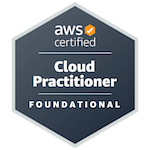

# Hi, I'm Daniel 👋

### Software Development Student · Cloud Security & DevSecOps Focus

I'm **Daniel Millán Pérez**, a software development student focused on building secure, automated and maintainable cloud applications.

I combine **software engineering, AWS and infrastructure as code** through hands-on projects, with an emphasis on architecture documentation, automation and security by design.

---

## 🏅 Certifications

**AWS Certified Cloud Practitioner**  
[Verify credential on Credly ↗](https://www.credly.com/badges/74ed461d-1530-4731-a110-4c27f6f238b5/public_url)

---

## 👨‍💻 About Me

- 🎓 Studying **Multiplatform Application Development (DAM)**.
- ☁️ Developing a professional focus in **AWS, Cloud Security and DevSecOps**.
- 🏗️ Working with **Terraform and Docker** to build reproducible infrastructure and application environments.
- 🔐 Exploring **least-privilege access, vulnerability management and security automation**.
- 💻 Building applications with **Java, Python, SQL and Spring Boot**.
- 🌍 Interested in **remote and international opportunities**.

My goal is to bring **development, cloud and cybersecurity** together throughout the software lifecycle.

---

## 🚀 Featured Project

### [IMPERATOR — Executive Operational Intelligence Platform](https://github.com/Dmillan-dev/ImperatorProyect)

A project focused on transforming operational data and events into **actionable business intelligence**.

IMPERATOR brings together software engineering, cloud infrastructure, data processing, security and automation. It is where I apply and develop my skills through practical implementation.

**Areas of focus:** Cloud infrastructure · Software architecture · Data processing · Security · Automation

[Explore the repository ↗](https://github.com/Dmillan-dev/ImperatorProyect)

---

## 🛠️ Technical Skills

### Cloud & Infrastructure
`AWS` `IAM` `EC2` `S3` `VPC` `Terraform` `Docker` `Docker Compose`

Cloud architecture, infrastructure as code, AWS Well-Architected principles, shared responsibility and cost management.

### Software Development & Databases
`Java` `Python` `Spring Boot` `Maven` `SQL` `JavaScript` `C++` `Bash`  
`PostgreSQL` `MongoDB`

Application development, relational and document databases, and database design.

### Security & DevSecOps
`Trivy` `Nmap` `Wireshark` `Zeek`

Least-privilege access, secure architectures, container security, vulnerability scanning, secret detection and security automation.

### Systems & Networking
`Linux` `Git` `GitHub`

TCP/IP, DNS, HTTP/HTTPS, network security and computer architecture, including ARMv4 assembly.

### AI & Cloud Services
`Amazon Bedrock` `Amazon SageMaker`

Foundational knowledge of generative AI, foundation models, prompt engineering, RAG, knowledge bases and responsible AI.

---

## 📚 Current Learning Priorities

- **AWS architecture and security:** designing cloud environments with appropriate access controls.
- **DevSecOps:** integrating security checks and automation into development workflows.
- **Infrastructure as code:** building reproducible environments with Terraform.
- **Container security:** identifying vulnerabilities and improving deployment practices.
- **Cloud AI:** exploring AI services, security and governance.

---

> **Learn by building. Build with purpose. Secure by design.**
