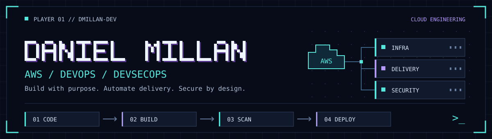
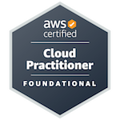
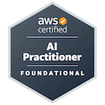
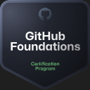

  

# Hi, I'm Daniel 👋

### Software Development · AWS · DevOps & DevSecOps

I'm **Daniel Millán Pérez**, a **Multiplatform Application Development (DAM)** student building secure cloud applications and reproducible infrastructure. My focus is on **software architecture, delivery automation and security by design**.

🌍 Interested in remote and international opportunities.

---

## 🏅 Certifications

<table>
  <tr>
    <td align="center" width="33%">
      
       
      <strong>AWS Certified Cloud Practitioner</strong>
       
      <a href="https://www.credly.com/badges/74ed461d-1530-4731-a110-4c27f6f238b5/public_url">Verify on Credly ↗</a>
    </td>
    <td align="center" width="33%">
      
       
      <strong>AWS Certified AI Practitioner</strong>
       
      <a href="https://www.credly.com/badges/65d314c1-b909-415f-be2e-3c0542954b30/public_url">Verify on Credly ↗</a>
    </td>
    <td align="center" width="33%">
      
       
      <strong>GitHub Foundations</strong>
       
      <a href="https://learn.microsoft.com/api/credentials/share/en-us/DanielMillnPrez-3148/831B7C327D2825F8?sharingId=C1DE962734AB621F">Verify credential ↗</a>
    </td>
  </tr>
</table>

---

## 🚀 Featured Project

### [IMPERATOR — Enterprise Decision Intelligence Platform](https://github.com/Dmillan-dev/ImperatorProyect)

A **security-first platform** that turns operational evidence into explainable, measurable and auditable business decisions. It connects evidence, deterministic recommendations, human review and an **append-only Decision Ledger** to track expected and validated business value.

- **Architecture:** Java 21 / Spring Boot modular monolith with hexagonal boundaries, PostgreSQL persistence and a Next.js Decision Review Workspace.
- **Security & delivery:** JWT/RBAC, read-only GitHub and AWS evidence connectors, hardened Docker images, GitHub Actions CI, Trivy scanning and CodeQL.
- **Cloud direction:** Terraform and OIDC workflows prepare an ECS/Fargate and RDS pilot; an optional Amazon Bedrock adapter provides audited explanations.

**Current stage: pre-pilot.** The core application and repository automation are implemented; live AWS deployment and provider validation remain pending.

[Explore the repository ↗](https://github.com/Dmillan-dev/ImperatorProyect) · [Technical evidence ↗](https://github.com/Dmillan-dev/ImperatorProyect/blob/main/docs/portfolio/technical-evidence.md) · [Architecture decisions ↗](https://github.com/Dmillan-dev/ImperatorProyect/blob/main/docs/decisions/14_Decision_Log.md)

---

## 🛠️ Technical Skills

| Area | Technologies & focus |
| --- | --- |
| **Cloud & Infrastructure** | AWS (`IAM`, `EC2`, `S3`, `VPC`) · Terraform · Docker / Compose |
| **Development & Tooling** | Java · Python · Spring Boot · Maven · Git / GitHub · Bash |
| **Databases** | SQL · PostgreSQL · MongoDB |
| **Security & DevSecOps** | Trivy · Nmap · Wireshark · Zeek · least privilege · vulnerability scanning |
| **Systems & Networking** | Linux · TCP/IP · DNS · HTTP/HTTPS |
| **AI Foundations** | Amazon Bedrock · Amazon SageMaker · generative AI · responsible AI |

  
Additional experience

  C++ · JavaScript · ARMv4 Assembly · computer architecture fundamentals.

---

## 📚 Current Learning Priorities

- **AWS Certified Solutions Architect – Associate preparation:** resilient cloud design, networking, access controls and cost optimization.
- **AWS Certified Developer – Associate preparation:** AWS application development, deployment, CI/CD workflows and troubleshooting.
- **DevSecOps & infrastructure as code:** reproducible Terraform environments, automated security checks and container hardening.
- **Cloud operations:** deployment readiness, observability and recovery practices through IMPERATOR's AWS pilot preparation.
- **Cloud AI:** bounded Amazon Bedrock integrations, explanation quality and governance.

---

> **Learn by building. Build with purpose. Secure by design.**
